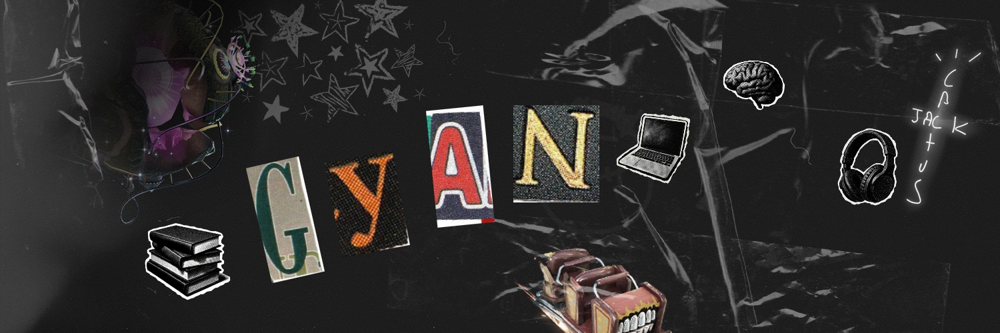

<!-- Typing Animation -->

 

---

# 👋🏽 Welcome to My GitHub!

### 💡 About Me  

- 💻 **Full-Stack Web Developer/Game Developer** who enjoys building intuitive front-end experiences and reliable back-end systems. I work with **JavaScript, HTML, CSS, and Python**, and I’m always exploring new tools and technologies to sharpen my craft.

- 🛠️ I enjoy working around the stack, whether it’s learning responsive UIs. I care about writing clean, maintainable code and creating software that feels intentional and user-centered.

- 🚀 Passionate about learning more, problem-solving, and bringing ideas to life through thoughtful engineering. Currently building projects, improving my skills, and experimenting with new technologies.

- 🎮 Outside of coding, I enjoy **watching tv, reading, gaming, fitness**, and exploring new experiences that keep me creative and balanced!
---

### 👨🏽‍💻 Tech Stack  

  
  
  
  
  
  
  
  
  
  
  
  
  
  
  

---

---

### 🚀 Featured Projects  

| Project | Description | Tech Stack | Status | Links |
|---------|-------------|------------|--------|-------|
| **[NYC Hunger](https://github.com/Santii-btn/hackathon)** | Created a GitHub website in a Hackathon at Queen Technical High School with 2 other team members, using HTML/CSS about the hunger issues around NYC by adding a donation and impact across the city. | In progess | <!--[Repo](https://github.com/kingmcleod/the-daily-doodle)!-->

---
<!--### 🎧 My Current Soundtrack  
*For Now!*  

  

!-->

---
<!--### 💻 LeetCode Stats
> “Consistency beats intensity — one problem a day adds up.”
> 
📂 Check out my daily LeetCode solutions here: [kings-daily-leetcode →](https://github.com/KingMcLeod/kings-daily-leetcode)

  

!-->

---

### 🌐 Connect with Me  

  
  
  

  

<picture>
  <source media="(prefers-color-scheme: dark)" srcset="https://raw.githubusercontent.com/husty245/husty245/output/pacman-contribution-graph-dark.svg">
  <source media="(prefers-color-scheme: light)" srcset="https://raw.githubusercontent.com/husty245/husty245/output/pacman-contribution-graph.svg">
  
</picture>

###

###
